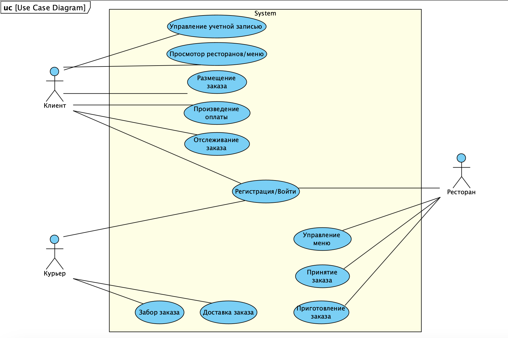
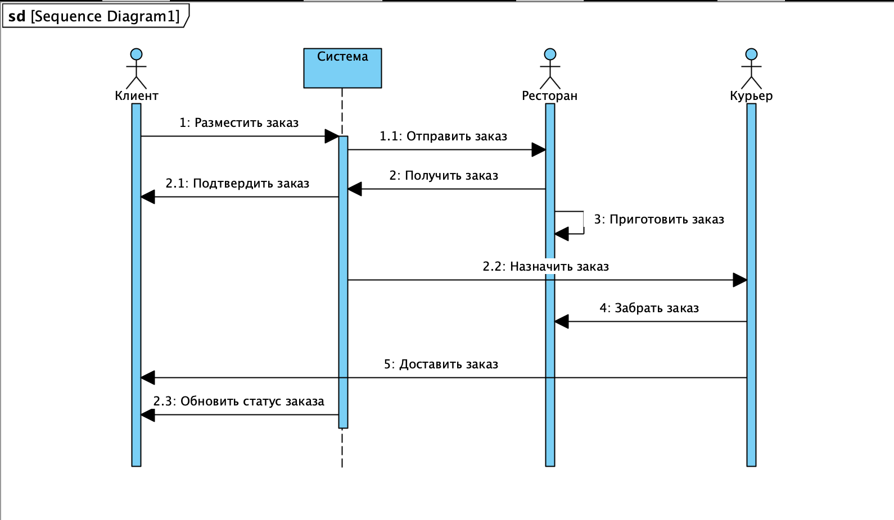
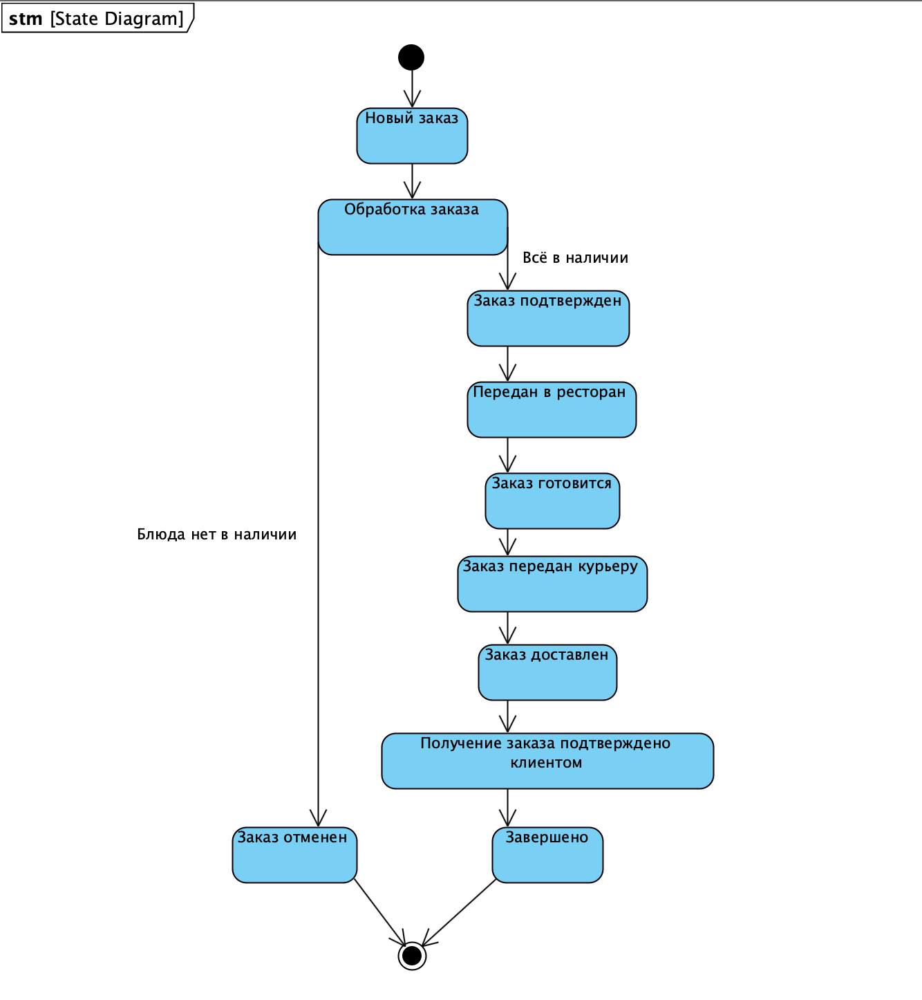
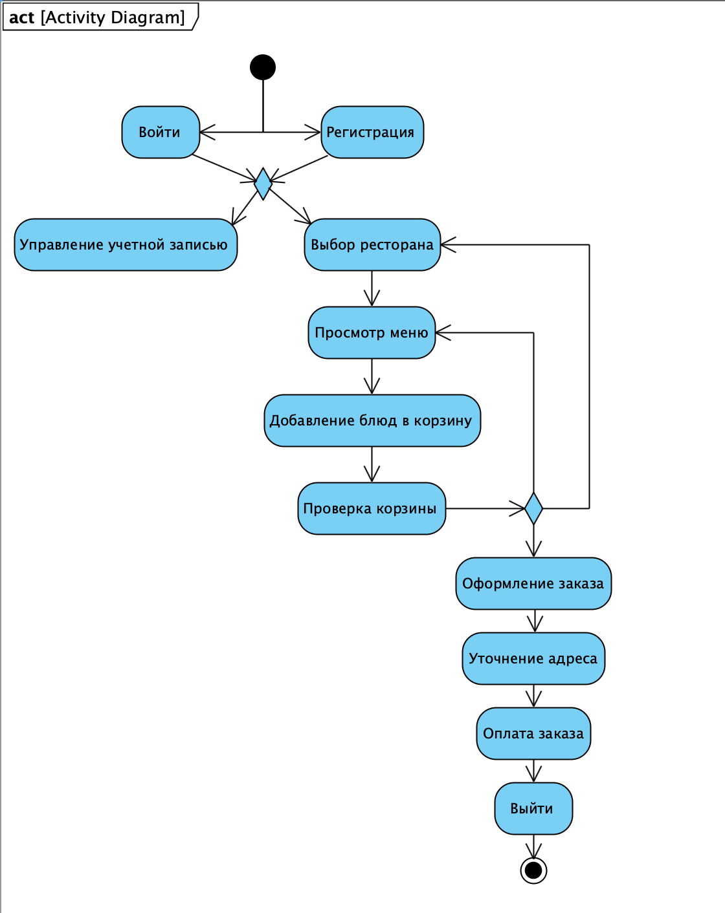
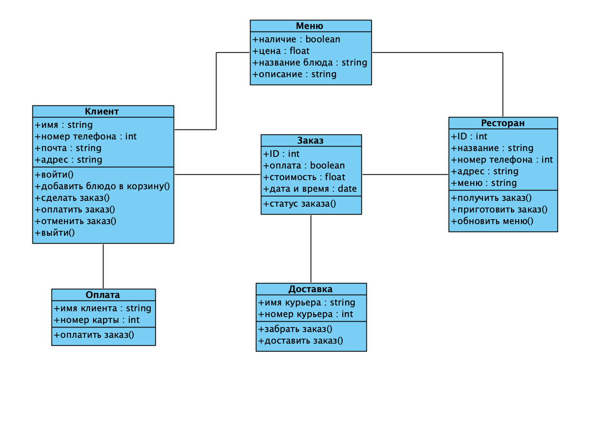

# TP_homework_3
Приложение для доставки еды позволяет пользователям заказывать еду из различных ресторанов и доставлять ее к себе домой. В приложении предусмотрены три основные роли пользователя: «Клиенты», «Рестораны» и «Курьеры».

**Клиенты**: пользователи, которые просматривают меню, размещают заказы и отслеживают доставку.                       
**Рестораны**: предприятия, которые управляют меню, принимают заказы и готовят еду.                             
**Курьеры**: лица, которые получают запросы на доставку, забирают заказы из ресторанов и доставляют их клиентам.

Приложение состоит из нескольких ключевых функций:
1. Аутентификация пользователя: разрешение пользователям регистрироваться и входить в систему.
2. Управление рестораном. Рестораны могут управлять своими профилями, меню и статусами заказов.
3. Управление заказами: клиенты могут размещать заказы, которые обрабатываются и отслеживаются по различным статусам.
4. Управление доставкой: курьеры могут управлять своими задачами по доставке.
5. Обработка платежей: безопасная обработка платежей клиентов.

Система обеспечивает бесперебойную связь между клиентами, ресторанами и курьерами, обеспечивая удобство заказа и доставки еды.

**Диаграмма вариантов использования:**

* Регистрация/Войти: пользователи могут создать учетную запись или войти в существующую учетную запись.
* Просмотр меню/ресторанов: клиенты могут просматривать рестораны и их меню.
* Размещение заказа: клиенты могут размещать заказы из выбранных меню ресторана.
* Отслеживание заказа: клиенты могут отслеживать статус своих заказов.
* Управление меню: рестораны могут добавлять, редактировать или удалять пункты из своих меню.
* Принятие заказа: рестораны могут принимать или отклонять заказы клиентов.
* Приготовление заказа: рестораны готовят принятые заказы.
* Забор заказа: курьеры забирают заказ из ресторана.
* Доставка заказа: курьеры доставляют заказ к месту нахождения клиента.
* Обработка платежа: система обрабатывает платежи, сделанные клиентами.

**Диаграмма последовательности заказа еды:**

Диаграмма последовательности иллюстрирует взаимодействие клиента, ресторана, курьера и системы в процессе заказа еды. Он включает в себя этапы от размещения заказа до окончательной доставки.

**Диаграмма состояний заказа:**

Диаграмма состояний представляет различные состояния, через которые может проходить заказ в системе, например:
* Новый заказ: заказ размещен, но еще не обработан.
* Обработка заказа: есть ли блюда в наличии и т.д.
* Заказ подтвержден: заказ принят системой.
* Передан в ресторан.
* Заказ готовится: заказ готовится в ресторане.
* Заказ передан курьеру: заказ забирается курьером и уже в пути к покупателю.
* Заказ доставлен: заказ доставлен клиенту.
* Получение заказа подтверждено клиентом.
* Заказ отменен.

**Диаграмма деятельности для описания процесса обработки заказа системой:**

Диаграмма деятельности отображает рабочий процесс обработки заказа внутри системы, от входа клиента в систему до выхода из нее.

**Диаграмма классов для системы:**

Диаграмма классов показывает основные сущности в системе и их отношения. Основные классы или модули включают в себя:
* Клиенты: обеспечивает аутентификацию пользователей и управление профилями.
* Рестораны: управляет профилями ресторанов, меню и обработкой заказов.
* Заказы: управляет размещением заказов, отслеживанием и обновлением статуса.
* Доставка: выполняет задания курьеров.
* Оплата: управляет платежными транзакциями.
* Меню: содержит информацию о блюдах в меню и редактируется ресторанами

Эти диаграммы дают полный обзор приложения для доставки еды, охватывая его основные функции и взаимодействие между различными компонентами.
